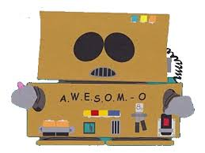

# Ronnie Bot


## Hopefully the Rudest Slack Bot Around!
Ronnie Bot began as a joke, but no longer.

His purpose is to annoy the shit out of my team mates 
and hopefully get a couple of laughs.

### Technical Requirements

- **[Python](https://www.python.org/downloads/)**, the programming language we're
going to use.
- **[Pip](https://pip.pypa.io/en/stable/installing/)**, the Python package manager
we'll use for installing packages we need.
- **[Virtualenv](https://virtualenv.pypa.io/en/latest/installation/)** or another
tool to manage a virtual environment

After you've cloned this repository locally, you'll want to create a virtual
environment to keep the dependencies for this project isolated from any other
project you may be working on.

If you're using `virtualenv` run the following commands from the root of your
project directory:

```bash
virtualenv venv
```

Then activate your new virtual environment:

```bash
source venv/bin/activate
```

After that, you can install all the Python packages this project will need with
this command:

```bash
pip install -r requirements.txt
```

### Server Requirements

Planning to run via Lambda and API Gateway via Zappa. This should Negate Server Requirement.  

Only problem is training-models of machine learning chatbot.